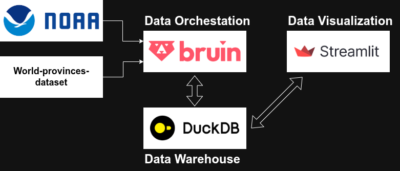
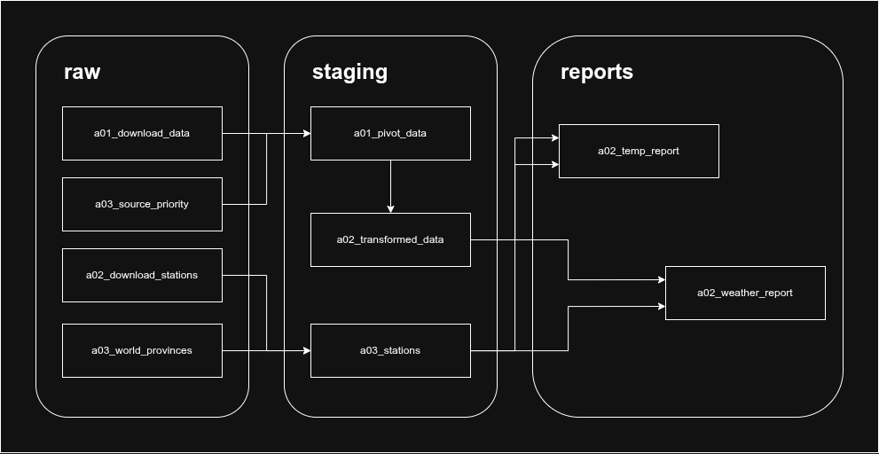

# Weather Data Engineer Pipeline (NOAA GHCN)

This project implements an automated data pipeline using [Bruin](https://getbruin.com/) to ingest NOAA's GHCN daily weather data from FTP, store it in DuckDB, and perform data quality checks.

## 1. Problem description

Currently, there are extensive meteorological data banks available. Analyzing this data allows for a better understanding of the impact of phenomena such as **climate change**, enabling the implementation of **preventive actions** for events like **droughts** and **floods**.

### 1.1. Dataset Usefulness

The NOAA GHCN Daily dataset is invaluable for identifying climate patterns due to its extensive historical records spanning centuries. By analyzing trends in temperature, precipitation, and other meteorological elements, researchers and policymakers can detect long-term climate changes, such as global warming, shifts in precipitation patterns, and increased frequency of extreme weather events. This data enables the identification of regional climate patterns, seasonal variations, and anomalies that inform climate modeling and risk assessment.

### 1.2. Need for Data Engineering Pipeline

To harness the full potential of this vast dataset, a robust data engineering pipeline is essential. The pipeline automates the download of raw data from NOAA's FTP servers, processes and cleans the data to handle inconsistencies and quality issues, transforms it into structured formats suitable for analysis (e.g., pivoting data for time-series analysis), and enables data visualization through interactive dashboards. This end-to-end approach ensures data reliability, scalability, and accessibility, allowing for timely insights into climate patterns without manual intervention.

## 2. Proposed Locally solution



### 2.1. Data Ochestration: Bruin 

In this project, we utilize [Bruin](https://getbruin.com/) as an end-to-end data pipeline platform to **orchestrate** the entire workflow from data ingestion to visualization. Bruin enables automated scheduling, quality checks, and transformations, ensuring reliable and efficient data processing.

### Data Storage: DuckDB
We store the processed data in DuckDB, an embedded analytical database designed for fast querying and analytics.

**Advantages of DuckDB:**
- High performance for analytical queries without requiring a separate database server.
- In-memory processing capabilities for quick data manipulation.
- Lightweight and easy to integrate into data pipelines.
- Supports SQL queries and is compatible with various data formats.

### Data Visualization: Streamlit
For data visualization, we use Streamlit to build interactive dashboards that allow users to explore climate patterns and insights.

**Advantages of Streamlit:**
- Simple and intuitive Python-based framework for creating web apps quickly.
- Supports interactive widgets for real-time data exploration.
- No need for front-end development skills; focuses on data science workflows.
- Easily deployable and shareable dashboards.

This local solution provides a complete, self-contained environment for climate data analysis.

## 3. Proposed Cloud solution

## 4. Batch Data Workflow

This project is driven by a Bruin pipeline that executes the complete NOAA GHCN workflow in stages:

1. **Raw ingestion**: Download raw weather records and supporting metadata.
2. **Staging and transformation**: Clean, prioritize, pivot, and enrich the raw data into analysis-ready tables.
3. **Reporting**: Build reusable report views that combine station metadata with climate observations.
4. **Visualization**: Expose the final outputs for dashboards and climate pattern exploration.

### 4.1. Bruin pipeline files and assets



- `template.bruin.yml`
  - Defines the default Bruin environment and connection settings.
  - Includes `noaa_duckdb` for local DuckDB storage and an optional `motherduck` connection for cloud deployment.

- `noaa_ghcn_locally/pipeline.yml`
  - Declares the pipeline name `noaa_ghcn_locally`.
  - Schedules pipeline execution once per year (`0 0 1 1 *`).

### 4.2. Raw ingestion assets

- `noaa_ghcn_locally/assets/assets_00_raw/a01_download_raw_data.py`
  - Downloads yearly GHCN CSV data from NOAA S3.
  - Parses station, date, element, value, and flag fields.
  - Writes to the raw table `raw.a01_download_raw_data` with append partitioning by date.
  - Includes column checks for required fields and record-level validation.

- `noaa_ghcn_locally/assets/assets_00_raw/a02_download_station.py`
  - Downloads the fixed-width station metadata file `ghcnd-stations.txt`.
  - Parses station IDs, location, elevation, state, flags, and WMO identifiers.
  - Creates/replace table `raw.a02_download_station`.

- `noaa_ghcn_locally/assets/assets_00_raw/a03_source_priority.sql`
  - Builds the source priority lookup table `raw.a03_source_priority`.
  - Ensures that when duplicate observations exist, highest-priority sources are selected.

- `noaa_ghcn_locally/assets/assets_00_raw/a04_world_provinces.py`
  - Downloads Natural Earth world provinces geojson.
  - Creates `raw.a04_world_provinces` for spatial station enrichment.

### 4.3. Staging and transformation assets

- `noaa_ghcn_locally/assets/assets_01_staging/a01_pivot_data.sql`
  - Filters raw records by data quality rules and valid ranges.
  - Joins GHCN source priority to keep the best source for each station/date/element.
  - Pivots element rows into wide form with one record per `station_id` and `date`.
  - Converts units for some fields, such as tenths-to-actual temperature values.
  - Writes `staging.a01_pivot_data`.

- `noaa_ghcn_locally/assets/assets_01_staging/a02_pivot_transformed_data.sql`
  - Expands multiday records into daily values.
  - Distributes multiday totals across individual days when needed.
  - Produces the cleaned, final climate observations table `staging.a02_pivot_transformed_data`.

- `noaa_ghcn_locally/assets/assets_01_staging/a03_stations.py`
  - Performs spatial enrichment by joining station coordinates with world province polygons.
  - Produces `staging.a03_stations`, a station lookup table with country, province, and ISO metadata.

### 4.4. Reporting assets

- `noaa_ghcn_locally/assets/assets_02_report/a01_temp_report.sql`
  - Joins enriched station metadata with transformed climate observations.
  - Produces `report.a01_temp_report` for temperature, precipitation, and snowfall analysis.

- `noaa_ghcn_locally/assets/assets_02_report/a02_weather_report.sql`
  - Builds a weather report view with symbolic weather categories and numeric climate codes.
  - Useful for dashboards and charts that classify conditions like heavy snow, rain, or clear-hot days.

## 5. Data Warehouse

All pipeline data is persisted in DuckDB through the Bruin connection `noaa_duckdb` defined in `template.bruin.yml`.

### DuckDB storage layout

- `raw.a01_download_raw_data`
  - Materialization: table
  - Strategy: append
  - Partitioned by: `date`
  - Clustered by: `station_id`, `element`
  - Purpose: stores raw NOAA GHCN daily observations with one row per station/date/element.

- `raw.a02_download_station`
  - Materialization: table
  - Strategy: create+replace
  - Clustered by: `id`
  - Purpose: stores station metadata parsed from `ghcnd-stations.txt`.

- `raw.a03_source_priority`
  - Materialization: table
  - Strategy: create+replace
  - Clustered by: `priority`
  - Purpose: stores source priority ordering used to resolve duplicate observations.

- `raw.a04_world_provinces`
  - Materialization: table
  - Strategy: create+replace
  - Purpose: stores Natural Earth province geometry for station spatial enrichment.

- `staging.a01_pivot_data`
  - Materialization: table
  - Strategy: create+replace
  - Partitioned by: `date`
  - Clustered by: `station_id`
  - Purpose: stores pivoted, validated observations with one row per station/date.

- `staging.a02_pivot_transformed_data`
  - Materialization: table
  - Strategy: create+replace
  - Partitioned by: `date`
  - Clustered by: `station_id`
  - Purpose: stores fully transformed daily climate values, including multiday expansion.

- `staging.a03_stations`
  - Materialization: table
  - Strategy: create+replace
  - Clustered by: `country`, `province`, `id`
  - Purpose: stores enriched station metadata joined with province and country information.

- `report.a01_temp_report`
  - Materialization: view
  - Purpose: exposes station metadata joined with temperature, precipitation, and snowfall metrics.

- `report.a02_weather_report`
  - Materialization: view
  - Purpose: exposes classified weather symbols and climate codes for dashboard consumption.

### Storage design rationale

- `date` partitioning improves performance for time-series queries and annual ingestion.
- `station_id` clustering improves locality for station-level analysis.
- `priority` clustering supports efficient resolution of duplicate source records.
- DuckDB provides a lightweight embedded analytical store that is ideal for fast local querying and integration with Streamlit dashboards.

## 6. Transformations

## 7. Data visualization: Streamlit Dashboard


## 8. Project Structure

- `.bruin.yml`: Project-level configuration and connection definitions.
- `pipelines/noaa_pipeline/`:
  - `pipeline.yml`: Pipeline definition and schedule.
  - `assets/`:
    - `ghcndaily.asset.yml`: Ingestion asset (FTP -> DuckDB) with quality checks.
    - `count_records.sql`: Transformation asset to count valid records.
- `.github/workflows/bruin.yaml`: Automated pipeline execution via GitHub Actions.

## 9. Prerequisites

- [Bruin CLI](https://bruin.dev/install.sh)
- Internet access (for NOAA FTP ingestion)

## 10. Getting Started

### 10.1. Install Bruin CLI

If you haven't installed Bruin yet, run:

```bash
curl -sSL https://bruin.dev/install.sh | sh
```

### 10.2. Validate the Pipeline

Before running, ensure the pipeline structure and assets are valid:

```bash
bruin validate .
```

### 10.3. Run a Dry Run

To see what Bruin will execute without actually moving data:

```bash
bruin run . --dry
```

### 10.4. Execute the Pipeline

Run the ingestion and transformation for the default range (1800-2025):

```bash
bruin run .
```

### 10.5. Running for a Specific Year Range (Testing)

You can now run a range of years with a single command:

```bash
# Example: Download data from 2000 to 2020 in one go
bruin run pipelines/noaa_pipeline --var start_year=2000 --var end_year=2020
```

The Python asset will internally loop through each year and append the data to DuckDB.

## Data Quality Checks

The pipeline includes built-in quality checks for the `ghcndaily` table:

- `station_id`: Must not be null.
- `date`: Must follow the ISO 8601 format (`YYYY-MM-DD`).
- `temp`: Must be numeric and not null.
- `precip`: Must be numeric and not null.

If any check fails, Bruin will stop the pipeline and report the error.


